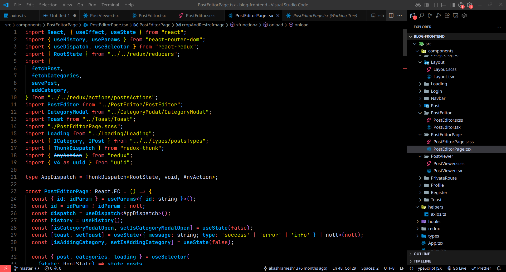

# NeonBloom Red Night

A neon-red dark theme for Visual Studio Code inspired by my custom Konsole and Firefox setup.  
Perfect if you love deep black backgrounds with striking red highlights and neon accents.



## Features

- Pure black background for low eye strain  
- Neon red (#ff5555) highlights and accents  
- Neon blue bold function names for easy recognition  
- Neon yellow strings and numbers for contrast  
- Styled selection, cursor, and UI elements  

## Installation

### From VS Code Marketplace

Search for **NeonBloom Red Night** and install it directly from the Extensions panel.

### Manual installation

1. Download the `.vsix` from the Releases tab  
2. Run:  
   ```bash
   code --install-extension neonbloom-red-night-x.y.z.vsix

## Contributing

Feel free to fork and open pull requests or issues!

## License

MIT © [Akash Ramesh](https://github.com/akashramesh13)
